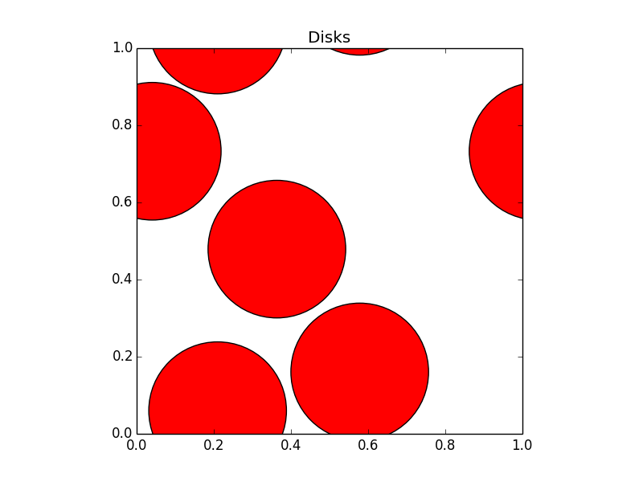
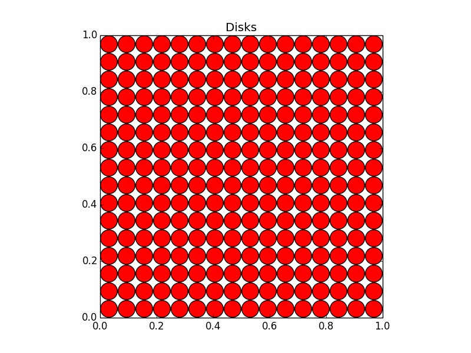
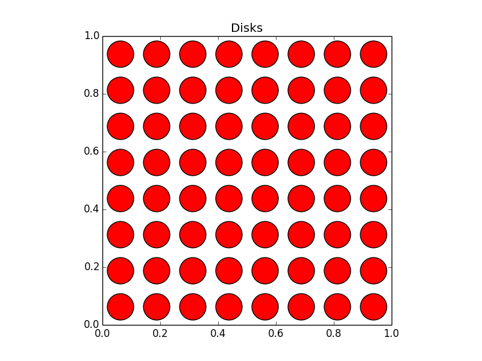
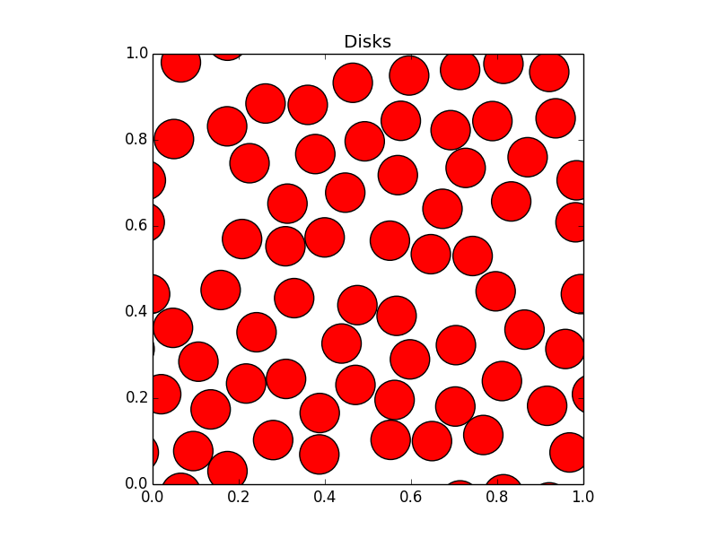
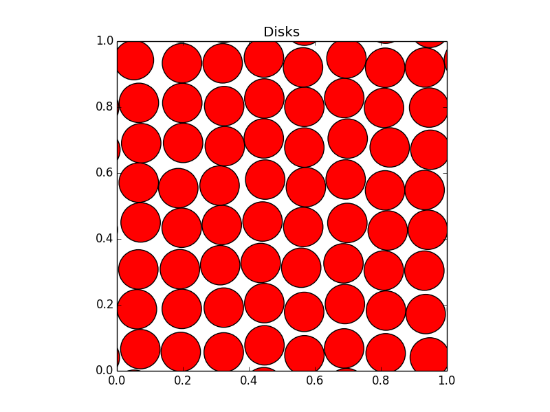
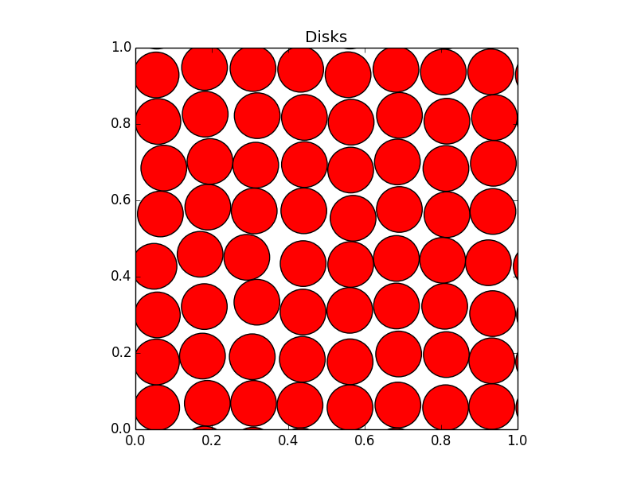

## A

In this entire homework session, we consider disks in a square box of length 1.0 with periodic boundary conditions. We will modify the algorithm markov_disks_box.py to work for N = k^2 disks and to incorporate these boundary conditions. Before starting, please remind yourself of the following modulo operations in Python:
```
 1.2 % 1.0 = 0.2
-0.2 % 1.0 = 0.8
```
Note the second line: the modulo "%" conveniently folds negative floating point numbers into the real interval [0.0, 1.0] and, in our case, into the box.

## A1

In this Section we provide two preparation programs:

PREPARATION PROGRAM 1:

```python
import pylab
def show_conf(L, sigma, title, fname):
    pylab.axes()
    for [x, y] in L:
        for ix in range(-1, 2):
            for iy in range(-1, 2):
                cir = pylab.Circle((x + ix, y + iy), radius=sigma,  fc='r')
                pylab.gca().add_patch(cir)
    pylab.axis('scaled')
    pylab.title(title)
    pylab.axis([0.0, 1.0, 0.0, 1.0])
    pylab.savefig(fname)
    pylab.show()
    pylab.close()

L = [[0.9, 0.9]]
sigma = 0.4
show_conf(L, sigma, 'test graph', 'one_disk.png')
```

Download (cut-and-paste) and run Preparation Program 1. Explain in a few words each:

* Which geometrical object does it draw?

four circles

* What is the color of the object, and where is it specified?

red, fc='r' is the code that specifies it

* How does it implement periodic boundary conditions?
* What makes that you can see it on the computer screen?

13: `pylab.show()`

* Does this program create a file? What is this file's name? How would you change it?

yes, it creates a file with name one_disk.png. If we need another name we could change the parameter to show_conf function

## A2

Make sure you do not have a file "disk_configuration.txt" in your working directory. Then download (cut-and-paste) the following program.

PREPARATION PROGRAM 2:

```python
import os, random

filename = 'disk_configuration.txt'
if os.path.isfile(filename):
    f = open(filename, 'r')
    L = []
    for line in f:
        a, b = line.split()
        L.append([float(a), float(b)])
    f.close()
    print 'starting from file', filename
else:
    L = []
    for k in range(3):
        L.append([random.uniform(0.0, 1.0), random.uniform(0.0, 1.0)])
    print 'starting from a new random configuration'

L[0][0] = 3.3
f = open(filename, 'w')
for a in L:
   f.write(str(a[0]) + ' ' + str(a[1]) + '\n')
f.close()
```

Run Preparation Program 2, then run it a second time. Explain in a few words each:

* What does the "if os.path.isfile(filename)" condition test?

If a regular file exists(regular according to the unix definition)

* What is the difference between "f = open(filename, 'r')" and "f = open(filename, 'w')"?

`r` stands for read-only and `w` for write mode when opening the file

* What is the meaning of "a, b = line.split()"

Splits the line by space separator - `' '` and assigns the components to a and b. The code would fail if there are less than 2 or more than 2 components.

* What is the meaning of "f.write(str(a[0]) + ' ' + str(a[1]) + '\n')", and in particular of the "\n"?

It writes data to the file. `'\n'` writes a new line after each entry.

* What is this program's potential use?

Generate or update disk positions, depending if a file with specific name is present.

## B

In this section, you write your own Markov-chain Monte Carlo simulation program for hard disks with periodic boundary conditions, "my_markov_disks.py" (or any other name that you like). The final version of my_markov_disks.py is relatively unsophisticated, but correct. It supports input-output and computes a non-trivial order parameter.

## B1

To construct my_markov_disks.py, start from markov_disks_box.py presented in lecture 2:

* Copy-and-paste the function dist() from direct_disks_multirun.py (presented by Alberto in Tutorial 2) into my_markov_disks.py. Note that dist() returns the distance between two disks and it already handles periodic boundary conditions. It is available on the Coursera website (in direct_disks_multirun.py).
* Modify the algorithm for periodic boundary conditions, that is, incorporate the dist() function.
* Attention: there are no more walls and wall collisions. Use the modulo operator (%) discussed in this homework's introductory paragraph to ensure that, after each accepted move, x and y positions of each disk are folded back into the interval 0.0 <= x < 1.0
* Run this algorithm for four disks

[[0.16679030346534138, 0.3701223455603218], [0.627838169027105, 0.2591400381027733], [0.023628687422443333, 0.8884297262149998], [0.8862573766629516, 0.38217864376772714]]

* Print your program.

```python
import math
import random


def dist(x, y):
    d_x = abs(x[0] - y[0]) % 1.0
    d_x = min(d_x, 1.0 - d_x)
    d_y = abs(x[1] - y[1]) % 1.0
    d_y = min(d_y, 1.0 - d_y)
    return math.sqrt(d_x ** 2 + d_y ** 2)


current = [[0.25, 0.25], [0.75, 0.25], [0.25, 0.75], [0.75, 0.75]]


sigma = 0.10
delta = 0.1
N = 10000

for steps in range(N):
    a = random.choice(current)
    b = [a[0] + random.uniform(-delta, delta), a[1] + random.uniform(-delta, delta)]
    min_dist = min(dist(b, c) for c in current if c != a)

    if min_dist / 2 < sigma:
        continue

    a[0] = b[0] % 1.0
    a[1] = b[1] % 1.0

print(current)
```

## B2

Further modify my_markov_disks.py in two ways:

* The covering density (eta) is defined as the number of disks times the area of one disk, divided by the total system area: eta = N * (pi * sigma ** 2). Modify your program so that the value of eta is fixed, and the radius sigma is deduced from it. Do not use (at this point) densities eta larger than 0.75.
* Incorporate Preparation program 1 in my_markov_disks.py, so that you can plot the final configuration produced by the program (do not attempt to plot intermediate configurations, this often poses problems in Python).

Print this new program (which simulates disks in the periodic box and is able to produce graphics).

```python
import math
import random
import pylab

def dist(x, y):
    d_x = abs(x[0] - y[0]) % 1.0
    d_x = min(d_x, 1.0 - d_x)
    d_y = abs(x[1] - y[1]) % 1.0
    d_y = min(d_y, 1.0 - d_y)
    return math.sqrt(d_x ** 2 + d_y ** 2)


current = [[0.25, 0.25], [0.75, 0.25], [0.25, 0.75], [0.75, 0.75]]


eta = 0.4
sigma = math.sqrt(eta / (len(current) * math.pi))
delta = 0.1
n_tries = 10000

for steps in range(n_tries):
    a = random.choice(current)
    b = [a[0] + random.uniform(-delta, delta), a[1] + random.uniform(-delta, delta)]
    min_dist = min(dist(b, c) for c in current if c != a)

    if min_dist / 2 < sigma:
        continue

    a[0] = b[0] % 1.0
    a[1] = b[1] % 1.0

def show_conf(L, sigma, title, fname):
    pylab.axes()
    for [x, y] in L:
        for ix in range(-1, 2):
            for iy in range(-1, 2):
                cir = pylab.Circle((x + ix, y + iy), radius=sigma,  fc='r')
                pylab.gca().add_patch(cir)
    pylab.axis('scaled')
    pylab.title(title)
    pylab.axis([0.0, 1.0, 0.0, 1.0])
    pylab.savefig(fname)
    pylab.show()
    pylab.close()


show_conf(current, sigma, "Disks", "b2.png")

```

## B2 (continued)

Print the plot of one configuration (as a graphics file) produced by my_markov_disks.py. Make sure it invokes periodic boundary conditions (at least one disk should be cut up into several pieces).



## B3

Further modify my_markov_disks.py by incorporating Preparation program 2, so that it can obtain its initial configuration either from a file (if it exists) or otherwise from the program itself. The filename should read something like disk_configuration_N16_eta0.72.txt, which can be obtained as

```python
filename = 'disk_configuration_N%i_eta%.2f.txt' % (N, eta)
```

To generate a new initial configuration, generalize the four-disk square-lattice initial configuration
```python
L = [[0.25, 0.25], [0.25, 0.75], [0.75, 0.25], [0.75, 0.75]]
```
to the case of N = k^2 disks. The initial condition for k=8 (N=64) is shown in the figure initial_configuration_64.png.

To produce this configuration, use something like the following line

```python
L = [[delxy + i * two_delxy, delxy + j * two_delxy] for i in range(N_sqrt) for j in range(N_sqrt)]
```

with correct values of N_sqrt and two_delxy (and with a correct choice of sigma, later in the program).

Choose a stepsize (delta) on the order of sigma, for example 0.3 sigma, or 0.5 sigma. The value itself in uncritical.The program should work for N equal to a square number, not for general N. The final configuration should then be saved in a file, as indicated in Preparation program 2, ready for reuse at the next run of my_markov_disks.py.

* Indicate up to which density the square-lattice initial configuration is legal.

## B3 (continued)
* Print your program.

```python
import math
import random
import pylab
import os
import random

def dist(x, y):
    d_x = abs(x[0] - y[0]) % 1.0
    d_x = min(d_x, 1.0 - d_x)
    d_y = abs(x[1] - y[1]) % 1.0
    d_y = min(d_y, 1.0 - d_y)
    return math.sqrt(d_x ** 2 + d_y ** 2)


N_sqrt = 16
N = N_sqrt * N_sqrt
delxy = 0.5 / (N_sqrt)

n_steps = 0
eta = 0.72
sigma = math.sqrt(eta / (N * math.pi))
delta = sigma * 0.2

filename = 'disk_configuration_N%i_eta%.2f.txt' % (N, eta)

if os.path.isfile(filename):
    f = open(filename, 'r')
    current = []
    for line in f:
        a, b = line.split()
        current.append([float(a), float(b)])
    f.close()
    print('starting from file', filename)
else:
    current = []
    for k in range(N):
        current = [[delxy + i * 2 * delxy, delxy + j * 2 * delxy] for i in range(N_sqrt) for j in range(N_sqrt)]
    print('starting from a new random configuration')

f = open(filename, 'w')
for a in current:
   f.write(str(a[0]) + ' ' + str(a[1]) + '\n')
f.close()

for steps in range(n_steps):
    a = random.choice(current)
    b = [a[0] + random.uniform(-delta, delta), a[1] + random.uniform(-delta, delta)]
    min_dist = min(dist(b, c) for c in current if c != a)

    if min_dist / 2 < sigma:
        continue

    a[0] = b[0] % 1.0
    a[1] = b[1] % 1.0

def show_conf(L, sigma, title, fname):
    pylab.axes()
    for [x, y] in L:
        for ix in range(-1, 2):
            for iy in range(-1, 2):
                cir = pylab.Circle((x + ix, y + iy), radius=sigma,  fc='r')
                pylab.gca().add_patch(cir)
    pylab.axis('scaled')
    pylab.title(title)
    pylab.axis([0.0, 1.0, 0.0, 1.0])
    pylab.savefig(fname)
    pylab.show()
    pylab.close()


show_conf(current, sigma, "Disks", "b3.png")
```

* Print the initial configuration (as a graphics file) for N = 256 at density eta= 0.72. (Note that you can do this easily by setting n_steps = 0).



## B4

Run my_markov_disks.py for N = 64, n_steps = 10000, at eta = 0.42 from the square lattice initial condition, then repeatedly using as initial configuration the final configuration of the previous run.

* Print the initial configuration (as a graphics file) of the sequence of runs (set n_steps = 0 to plot it)



* Print the final configuration (as a graphics file) of the entire sequence of run.



* Explain what you see (describe the final configuration and how the simulation got there).

This is a infinite plane(top and bottom on the graph are the same). We achieve it by moving a random disk a small amount each iteration.

## B5

Run my_markov_disks.py for N = 64, n_steps = 10000, at eta = 0.72 from the square lattice initial condition, then at least ten times using as initial configuration the final configuration of the previous run.

* Print at least one intermediate configuration (as graphics files) of the entire run (To upload several intermediate configurations, you may join the graphics files into one big file).

* Print the final configuration of the entire sequence of runs.

* Explain what you see (give some physical explanation of what the configurations look like).

The density is too high, so the disks cannot change places. Behaives similar to solid.

## C

This section is concerned with the quantitative interpretation of the findings of Sections B4 and B5. It contains a programming assignment for which help is provided in form of a code snippet. Some understanding of complex numbers is needed, but at a very elementary level.

Consider the local orientational order parameter psi_6(i), of disk i:

psi_6(i)=1/numberofneighbors \sum_j exp⁡(6I \phi_ij)

The local order parameter psi_6(i) is a complex number, I is the complex number (0.0, 1.0) and phi_ij is the angle with respect to the x-axis, measured in radians (0 degrees = 0, 360 degrees = 2 pi) . A "neighbor" j is a closeby other disk, we will take it to be a disk whose center is less than 2.8 sigma away from the center of disk i (there are more expert definition of neighborship, but this close proximity will be OK for our purposes).

NB: Note that the local order parameter is called psi (in small letters).

## C1

Consider the disks a, b, and c, the central disks in the following figure confs_abc.png.

1. What is the value of psi_6(a) (a complex number)?

psi_6(a) = (1-6.123233995736765e-16j) ~ 1

2. What is the value of psi_6(b) (a complex number)?

psi_6(b) = (-1+4.387286062550369e-16j) ~ -1

3. What is the value of psi_6(c) (a complex number)?

psi_6(c) =  (1.1176449493811067e-15+1j) ~ 1i

4. Compute psi_6(a) + psi_6(b) (a complex number).

psi_6(a) + psi_6(b) -1.735947933186396e-16j ~ 0

## C2

The global order parameter is defined as

Psi_6=1/N \sum_i psi_6(i)

(NB: Note the difference between Psi (capital letter) and psi.)

1. What is the value of Psi_6 for the two configurations A and B in figure lattices_base_tip.png? we suppose that they continue up to infinity.
A -> 1
B -> -1

2. What is the value of Psi_6 for a very large liquid configuration with eta = 0.42, (N very large, all correlation lengths much smaller than system size)?

## C3 (bonus point, not part of the grade)

It can be shown numerically that the average of |Psi_6| is finite for very large systems of hard disks at density eta > 0.72.

Incorporate the calculation of Psi_6 into my_markov_disks.py using the following code snippet. Note that you need the cmath library to perform complex arithmetic. Note also that 6j = (0.0, 6.0), in complex notation. The delx_dely function computes the distance vector, corrected for periodic boundary conditions.

```python
def delx_dely(x, y):
    d_x = (x[0] - y[0]) % 1.0
    if d_x > 0.5: d_x -= 1.0
    d_y = (x[1] - y[1]) % 1.0
    if d_y > 0.5: d_y -= 1.0
    return d_x, d_y

def Psi_6(L, sigma):
    sum_vector = 0j
    for i in range(N):
        vector  = 0j
        n_neighbor = 0
        for j in range(N):
            if dist(L[i], L[j]) < 2.8 * sigma and i != j:
                n_neighbor += 1
                dx, dy = delx_dely(L[j], L[i])
                angle = cmath.phase(complex(dx, dy))
                vector += cmath.exp(6.0j * angle)
        if n_neighbor > 0:
            vector /= n_neighbor
        sum_vector += vector
    return sum_vector / float(N)
```

Incorporate this snippet into my_markov_disks.py, and produce a plot of the mean absolute value of Psi_6 as a function of density eta for N = 64, up to density of eta = 0.72.

For simplicity, you may follow this scheme

* start at eta = 0.72 (with a "well-thermalized" configuration, produced by a long run of the program of point B3)
* compute |Psi_6| every 100 steps
* decrease the density by a small amount (e.g. 0.02) after each 10000 steps, using the final configuration at higher density as initial configuration at lower density,
* repeat till you reach a low density (e.g. eta=0.2).

Once the code is ready:
* print the program.
* Print the produced plot for the average of |Psi_6| as function of the density eta (put correct labels on the axis). If the program takes too much time, reduce the number of steps to 5000. If you have time, feel free to use more values of eta, or to perform longer runs. NB: in any case, your plot will be qualitative at high density, as we cannot reach large enough simulation times, even for 64 disks. But notice that we are following a completely correct procedure.
* Comment the plot: how does the average of |Psi_6| depend on the density eta? What happens at low density? What happens at high density?

NB: You should realize that getting to this version of my_markov_disks.py, through all the previous steps, constitutes a considerable achievement!

NNB: The nature of this phase transition has been a mystery for several decades, and its detailed description is beyond the scope of this homework (in fact, there are two transitions at close-by densities). The seminal simulations of Metropolis et al (1953) used N between 56 and 224 and n_steps=20000. These simulation times are roughly 1000000 times smaller than the correlation times of the Markov chain for eta = 0.72, and this explains much of the confusion in the field. Mathematical estimates for the correlation time are unavailable. Likewise, the existence of the transition(s), while established beyond doubt by numerical simulations, is a mathematical mystery.
